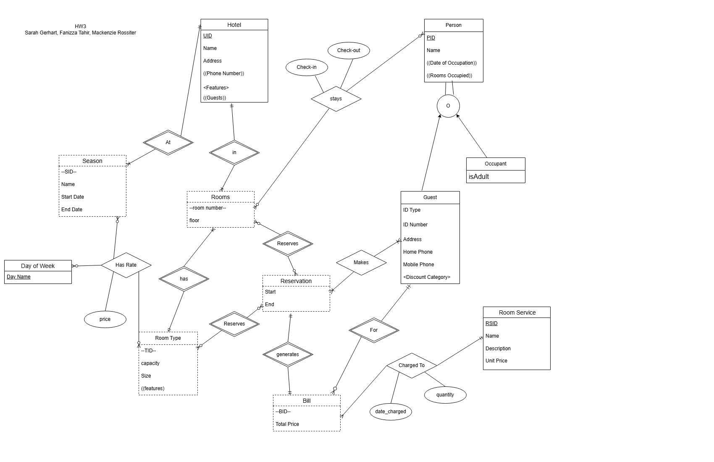
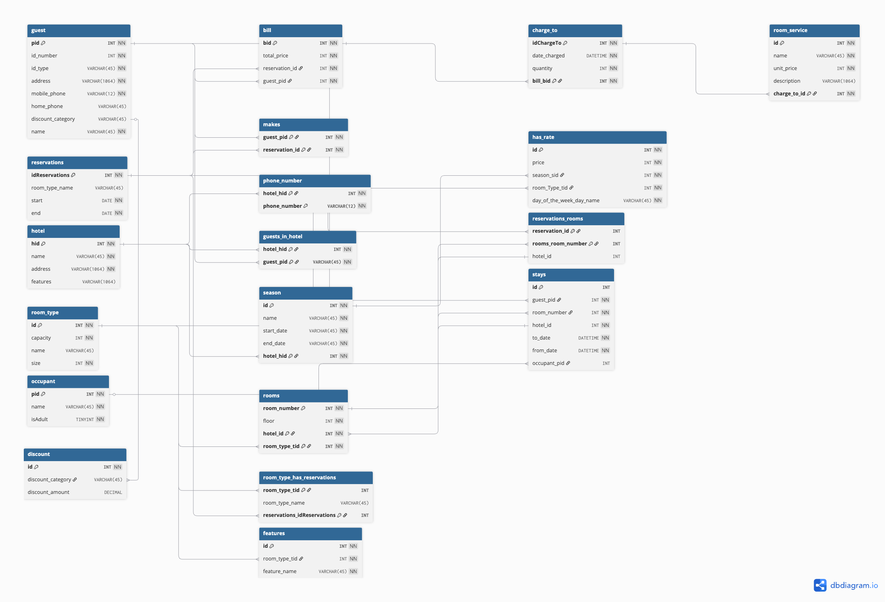

# CS374 Hotel Database Final Report
*Kenzie Rossiter, Sarah gerhart, Faz *

## ER Model
*insert the image here*

*No Changes since HW 7*

## Relational Model
*insert the image(s) here*

- Conference Review System: 

*Describe any changes since HW7*

## Database creation
*Link the files here*

- Drop tables: [drop.sql](database/ref_drop_constraints.sql)
- Create tables: [create.sql](database/create_script.sql)
- Add constraints to tables: [alter.sql](database/refkeys.sql)

*They should be in a subdirectory called database*

*Describe any changes very briefly: for example:*

Sarah:
We added an occupant who is staying in the same room as a guest. Before, we had all guests staying in their own rooms with no occupant.

Kenzie:
Added a field to room_type called name
Added a field to reservations called room_type_name and then added a FK constraint that connect it to the room_type.  This was needed so customers can reserve a certain room type when they make their reservations.
Added room_type_name to the room_type_has_reservations table
Updated dbdiagram to match changes made

We changed the scripts to match updated model shown in previous section.

## Data
*Link the files here*

- Add some data: [creat_data.sql](./data/create_data.sql)
     - [newData-Kenzie-Query2.sql](./data/newData-Kenzie-Query2.sql)

We changed the data to facilitate the queries, as described in the following sections.  There are additions in the original create_data file as well as a new file with new data additions for a query.

## Queries

### Query 1
*Link the code file(s) here from subdirectory queries*

For example:
- [workshop_leader.py](./queries/workshop_leader.py)

*Describe the queries in detail with screenshots of the data setup and the results*

### Query 2
*Link the code file(s) here from subdirectory queries*
[query2-kenzie-pgadmin.sql](./queries/query2-kenzie-pgadmin.sql)

*Describe the queries in detail with screenshots of setup and results*
For this query, I selected the room numbers and room types.  To find the rooms that are double that are not yet occupied, I did a LEFT JOIN between the room_reservations table and the rooms table.  I then searched for rooms of type 'Double'.  I then was given a list of unoccupied double rooms.  I chose one of those rooms and wrote an insert query to assign Mrs. Smith her reserved double room.

### Query 3
*Link the code file(s) here from subdirectory queries*
[sarah_hw8queries.sql](./queries/sarah_hw8queries.sql)

*Describe the queries in detail with screenshots of setup and results*
For this query, I first inserted data for an extra service used by the guest as well as added Barbara Manatee as a guest and the tables necessary for this query. I then selected the start date, end date, room type, extra services, and total cost for the stay. To calculate the total correctly, I started with the stays table because it has the check in and out dates. I then joined the rooms and room_type tables to determine what type of room the guest stayed in. To calculate the cost per night, i used generate_series to break the stay into individual dates. I then joined the season table to make sure each date matched the correct season and joined the has_rate table to get the price based on room type, season, and day of week. Next, I joined guest and discount to apply the guests discount. I included extra services in a subquery that joins the bill, charge_to, and room_service tables where it calculates the total cost of all extra services and combines their names (if there was more than 1) and the results are joined back to the main query. Finally, I summed the nightly room price with the discount applied and added the extra service total to get the final bill. To update the guest to be checked out, I updated a time stamp on their stay end date for when they checked out and removed them from the guests_in_hotel table.

### Query 4
*Link the code file(s) here from subdirectory queries*
[sarah_hw8queries.sql](./queries/sarah_hw8queries.sql)

*Describe the queries in detail with screenshots of setup and results*
For this query, I added data so there was a room that had two occupants in it at once. I selected the guest that reserved the room, the occupant in the room, and the room number. I started with the occupant table and joined the stays table based on the occupant id. Then, I got the guest that is linked with that stay. Based on out data, I picked a specific room number and date range that had two people staying in one room together. This then output the occupants and the guest who made the reservation for them.

### Query 5
*Link the code file(s) here from subdirectory queries*

*Describe the queries in detail with screenshots of setup and results*
